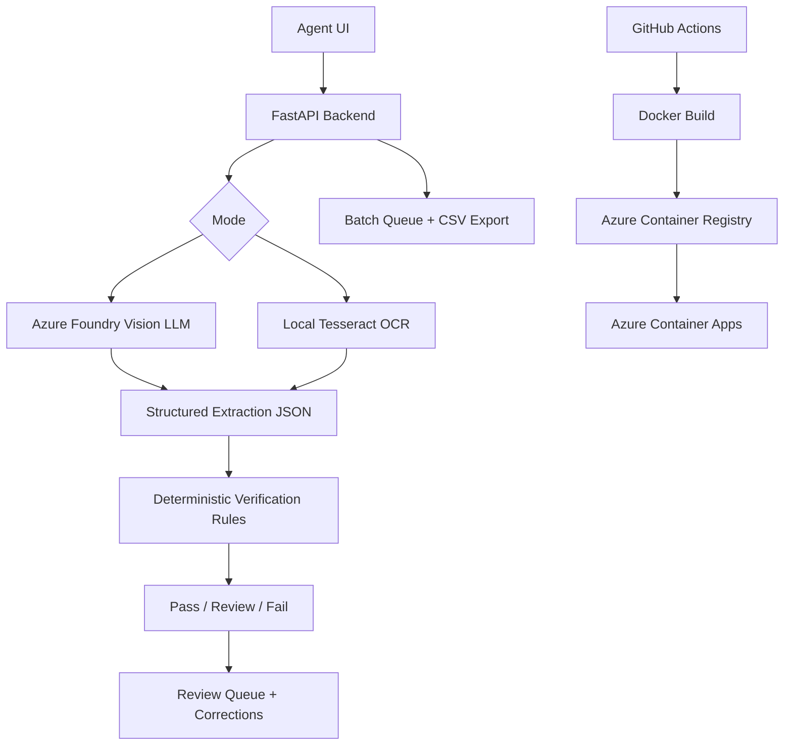

# TTB Label Verifier

AI-assisted label verification for matching alcohol beverage labels against TTB application data.

**Live app:** https://treasury-take-home-v3.greensea-d13af920.eastus2.azurecontainerapps.io  
**Primary runtime:** Python FastAPI + Azure Foundry vision model  
**Offline mode:** Local Tesseract OCR test path  
**Deployment:** Docker image on Azure Container Apps with GitHub Actions CI/CD

## 30-Second Summary

This project is a one-stop shop for agents reviewing alcohol label submissions. Agents can upload a single label, multiple panels of the same label, or a large batch folder with a manifest. The app extracts label evidence, compares it against application data, and returns a field-by-field **Pass / Review / Fail** result.

The core design is deliberate:

- **The LLM reads the label.**
- **Deterministic Python code makes the compliance decision.**
- **Local OCR mode exists for offline/firewall testing.**
- **Raw extraction text is hidden unless developer debug is explicitly enabled.**

## What It Checks

The verifier focuses on the fields that matter for TTB-style review:

- Brand name
- Class/type
- Alcohol content, including proof-to-ABV equivalence
- Net contents, with unit normalization
- Name and address of bottler/producer
- Country of origin
- Mandatory `GOVERNMENT WARNING` heading

Verdict policy:

- Missing or non-all-caps `GOVERNMENT WARNING` is always **Fail**.
- If application data is blank, that field is **Not Checked**, not failed.
- If exactly one non-warning observed field is missing, the result is **Review**.
- If two or more non-warning observed fields are missing, the result is **Fail**.
- Hard conflicts such as wrong ABV, wrong net contents, or country conflict remain **Fail**.

## Architecture



## Why This Approach

Vision models are useful for reading varied, image-heavy labels, but they should not be trusted to make the final regulatory decision. This app uses the model as an extraction layer only. The final verdict is made by deterministic code so the result is easier to audit, test, and explain.

Python was used for V3 because it allowed faster iteration on LLM extraction, JSON repair, image compression, Azure Foundry integration, and batch processing. The public API remains framework-neutral, so future COLA integration can call the service over HTTP without depending on the Python runtime.

## Tech Stack

- **Backend:** FastAPI, Pydantic, httpx
- **AI extraction:** Azure Foundry OpenAI-compatible endpoint, default deployment `gpt-4.1-mini`
- **Offline path:** Tesseract CLI OCR
- **UI:** Server-rendered HTML plus vanilla JavaScript and CSS
- **Deployment:** Docker, Azure Container Registry, Azure Container Apps
- **CI/CD:** GitHub Actions on push to `main`
- **Test data:** Public TTB COLA registry fixture builder

## Running Locally

From PowerShell:

```powershell
cd C:\Users\NashS\OneDrive\Documents\Treasury-Take-Home
copy .env.example .env
notepad .env
```

Set these values in `.env`:

```text
LLM_PROVIDER=azure_foundry
AZURE_FOUNDRY_ENDPOINT=https://ttb-label-verifier-resource.services.ai.azure.com/api/projects/ttb-label-verifier/openai/v1/
AZURE_FOUNDRY_API_KEY=your-foundry-key
AZURE_FOUNDRY_DEPLOYMENT=gpt-4.1-mini
ALLOW_LOCAL_OCR=true
```

Start the app:

```powershell
.\scripts\start_local.ps1
```

Open:

```text
http://localhost:8000
```

Manual startup:

```powershell
cd C:\Users\NashS\OneDrive\Documents\Treasury-Take-Home
python -m venv .venv
.\.venv\Scripts\Activate.ps1
pip install -r requirements.txt -r requirements-dev.txt
uvicorn app.main:app --reload --port 8000
```

## Docker

```powershell
docker build -t treasury-take-home-v3 .
docker run --rm -p 8000:8000 `
  -e LLM_PROVIDER=azure_foundry `
  -e AZURE_FOUNDRY_ENDPOINT="https://ttb-label-verifier-resource.services.ai.azure.com/api/projects/ttb-label-verifier/openai/v1/" `
  -e AZURE_FOUNDRY_API_KEY="your-foundry-key" `
  -e AZURE_FOUNDRY_DEPLOYMENT="gpt-4.1-mini" `
  treasury-take-home-v3
```

## API

| Method | Route | Purpose |
| --- | --- | --- |
| `GET` | `/` | Agent UI |
| `GET` | `/api/health` | Runtime config, provider availability, batch settings, security flags |
| `GET` | `/api/openapi.json` | OpenAPI contract |
| `POST` | `/api/verify` | Verify one product with 1-4 label images and optional manifest/application fields |
| `POST` | `/api/batch/jobs` | Start a batch job with many images and optional CSV/JSON manifest |
| `GET` | `/api/batch/jobs/{job_id}` | Poll batch progress and results |
| `GET` | `/api/batch/jobs/{job_id}/export.csv` | Export batch summary |
| `POST` | `/api/corrections` | Record an agent correction or final manual fail action |

`POST /api/verify` multipart fields:

- `images[]`: one to four label images
- `manifest`: optional `manifest.csv` or `manifest.json`
- `brand_name`, `class_type`, `alcohol_content`, `net_contents`, `bottler`, `country`: optional expected application fields
- `processing_mode`: `llm` or `local_ocr`
- `debug_mode`: `true` only when developer debug output is needed

`POST /api/batch/jobs` accepts the same application fields but supports many images. If no manifest is supplied, each image is treated as its own product. If a manifest is supplied, it maps images to application fields.

## Manifest Format

JSON manifests should use this shape:

```json
{
  "products": [
    {
      "product_id": "cola-12345678901234-image-01",
      "label": "Example Brand",
      "brand_name": "Example Brand",
      "class_type": "Wine",
      "alcohol_content": "12%",
      "net_contents": "750 mL",
      "bottler": "Example Winery, Lodi, CA",
      "country": "United States",
      "images": ["images/12345678901234_01.jpg"]
    }
  ]
}
```

CSV manifests support the same core columns:

```text
product_id,label,brand_name,class_type,alcohol_content,net_contents,bottler,country,images
```

## Offline Mode

The app includes a local OCR path for restricted-network demonstrations.

Requirements:

- Tesseract installed locally
- `ALLOW_LOCAL_OCR=true`
- Optional `TESSERACT_CMD` if Tesseract is not on `PATH`

PowerShell example:

```powershell
$env:ALLOW_LOCAL_OCR="true"
$env:TESSERACT_CMD="C:\Program Files\Tesseract-OCR\tesseract.exe"
```

In the UI, turn on **Local OCR** to force the offline path. No Azure Foundry or OpenRouter request is made in this mode.

Offline mode is useful for firewall-safe testing, but it is less accurate on stylized labels, curved text, small warning blocks, and low-resolution images.

## Dev Debug Mode

Normal agent output hides raw extraction text. This avoids leaking noisy OCR/LLM internals into observed values.

Debug behavior:

- UI debug mode shows timing, provider, model, confidence, and extraction metadata.
- Raw extraction is shown only when the server is explicitly configured with `SHOW_RAW_EXTRACTION=true`.
- Production should keep `SHOW_RAW_EXTRACTION=false`.

Local debug example:

```powershell
$env:SHOW_RAW_EXTRACTION="true"
```

Then enable debug mode in the UI before running a verification.

## COLA Stress Test Data

The scraper was rewritten as a self-contained fixture builder. It does not copy the referenced scraper implementation. It creates one batch folder with the most recent public COLA label images and a smaller single-verification folder from the same image set.

Generate the default 300-image stress fixture:

```powershell
python scripts/scrape_cola_dataset.py `
  --count 300 `
  --single-count 10 `
  --out-dir samples/cola-scale `
  --zip
```

If Windows certificate validation blocks the COLA site:

```powershell
python scripts/scrape_cola_dataset.py `
  --count 300 `
  --single-count 10 `
  --out-dir samples/cola-scale `
  --zip `
  --insecure-tls
```

Output:

```text
samples/cola-scale/
  batch-300/
    images/
    manifest.json
    application_data.csv
    README.md
    batch-300.zip
  single-verification/
    single-001-.../
      images/
      manifest.json
      application.json
      source.txt
```

Batch testing:

- Upload the `batch-300/images` folder.
- Attach `batch-300/manifest.json`.
- Start a batch job.

Single testing:

- Use any folder under `single-verification`.
- Upload its image and attach its `manifest.json`.

The generated `samples/cola-scale` folder can be committed if the zipped outputs stay within GitHub size limits. Larger local datasets should stay under `data/`, which is git-ignored.

## Performance Controls

These defaults keep image payloads and model output bounded:

```text
AZURE_FOUNDRY_REQUEST_TIMEOUT_SECONDS=5
AZURE_FOUNDRY_CONNECT_TIMEOUT_SECONDS=2
AZURE_FOUNDRY_MAX_OUTPUT_TOKENS=320
AZURE_FOUNDRY_MAX_IMAGE_LONG_EDGE=768
AZURE_FOUNDRY_JPEG_QUALITY=48
LLM_BATCH_PARALLELISM=2
LOCAL_OCR_BATCH_PARALLELISM=2
```

If latency is above the target, the bottleneck is usually model inference or provider queue time. The app still records per-result timings so slow cases can be separated from local processing cost.

## Deployment

GitHub Actions deploys `main` to Azure Container Apps.

Required GitHub repository secrets:

- `AZURE_CREDENTIALS`
- `ACR_NAME`
- `ACR_LOGIN_SERVER`
- `AZURE_CONTAINER_APP_NAME=treasury-take-home-v3`
- `AZURE_RESOURCE_GROUP=ttb-label-verifier-rg`
- `AZURE_FOUNDRY_API_KEY`

Required GitHub repository variables:

- `AZURE_FOUNDRY_ENDPOINT=https://ttb-label-verifier-resource.services.ai.azure.com/api/projects/ttb-label-verifier/openai/v1/`
- `AZURE_FOUNDRY_DEPLOYMENT=gpt-4.1-mini`

The workflow:

1. Installs dependencies.
2. Runs `ruff check`.
3. Runs `pytest`.
4. Builds the Docker image.
5. Pushes to Azure Container Registry.
6. Updates `treasury-take-home-v3` in Azure Container Apps.

## Tests

```powershell
.\.venv\Scripts\Activate.ps1
pytest
ruff check
node --check app/static/app.js
```

## Assumptions and Tradeoffs

- This is a prototype for review assistance, not a replacement for final human authority.
- Azure Foundry is the default mode because it is more accurate on image-heavy labels than local OCR.
- Local OCR is intentionally available for offline/firewall demonstrations.
- Application fields are optional; blank fields are not silently treated as matches.
- Raw extraction text is a developer tool, not normal agent-facing output.
- Batch jobs are in-memory for the prototype. A production COLA integration should use durable job storage.
- The COLA scraper uses public registry pages for testing fixtures only and is not part of the runtime app.
- The API boundary is HTTP/OpenAPI so COLA or .NET systems can integrate without sharing the Python runtime.
