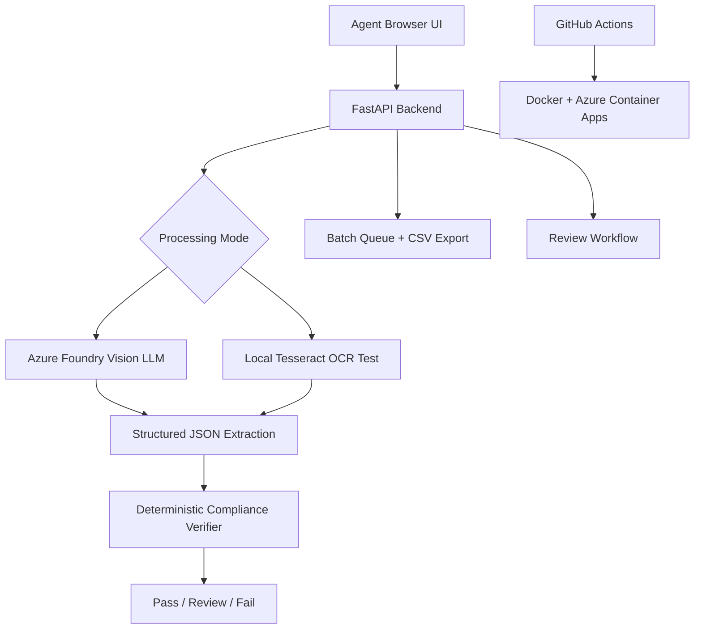

# Treasury Take Home V3

AI-assisted TTB label verifier for agents who need one place to upload alcohol label images, compare them against application data, and resolve review/fail cases.

**Live app:** [https://ttb-label-verifier.greensea-d13af920.eastus2.azurecontainerapps.io](https://treasury-take-home-v3.greensea-d13af920.eastus2.azurecontainerapps.io/)

V3 is **Azure Foundry LLM-first** by default. The LLM extracts structured label evidence from one or more images, but the final Pass / Review / Fail verdict is still deterministic Python compliance logic. Local Tesseract OCR remains available through an explicit Local OCR mode for offline/firewall demonstrations.

## What This App Does

- Single-product verification with 1-4 images for front/back/side labels.
- Batch verification with folder uploads and optional CSV/JSON manifests.
- Optional application-field comparison for brand, class/type, ABV/proof, net contents, bottler/producer address, and country.
- Government-warning check on every run.
- Agent review queue for labels that need manual attention.
- Dockerized FastAPI app deployed to Azure Container Apps through GitHub Actions.

## Core Rules

- Missing or non-all-caps `GOVERNMENT WARNING` is always Fail.
- If application fields are omitted, they are marked `not_checked`, not failed.
- If application fields are supplied, hard conflicts such as wrong ABV/proof, wrong net contents, brand conflict, or country conflict can Fail.
- Exactly one missing observed application field is Review; two or more missing observed fields are Fail.
- The LLM only extracts evidence; Python code decides the verdict.

## Architecture



## Run Locally

From PowerShell:

```powershell
cd C:\Users\NashS\OneDrive\Documents\Treasury-Take-Home
copy .env.example .env
notepad .env
```

In `.env`, set:

```text
AZURE_FOUNDRY_ENDPOINT=https://ttb-label-verifier-resource.services.ai.azure.com/api/projects/ttb-label-verifier/openai/v1/
AZURE_FOUNDRY_API_KEY=your-foundry-key
AZURE_FOUNDRY_DEPLOYMENT=gpt-4.1-mini
```

Then run:

```powershell
.\scripts\start_local.ps1
```

Open:

```text
http://localhost:8000
```

If you do not want to use Azure Foundry locally, turn on Local OCR mode in the UI and make sure Tesseract is installed.

## Manual Local Commands

If you do not want to use the startup script:

```powershell
cd C:\Users\NashS\OneDrive\Documents\Treasury-Take-Home
python -m venv .venv
.\.venv\Scripts\Activate.ps1
pip install -r requirements.txt -r requirements-dev.txt

$env:LLM_PROVIDER="azure_foundry"
$env:AZURE_FOUNDRY_ENDPOINT="https://ttb-label-verifier-resource.services.ai.azure.com/api/projects/ttb-label-verifier/openai/v1/"
$env:AZURE_FOUNDRY_API_KEY="your-foundry-key"
$env:AZURE_FOUNDRY_DEPLOYMENT="gpt-4.1-mini"

uvicorn app.main:app --reload --port 8000
```

## Performance Defaults

Azure Foundry is configured for smaller request payloads and bounded output:

```text
AZURE_FOUNDRY_REQUEST_TIMEOUT_SECONDS=5
AZURE_FOUNDRY_CONNECT_TIMEOUT_SECONDS=2
AZURE_FOUNDRY_MAX_OUTPUT_TOKENS=320
AZURE_FOUNDRY_MAX_IMAGE_LONG_EDGE=768
AZURE_FOUNDRY_JPEG_QUALITY=48
LLM_BATCH_PARALLELISM=2
```

These settings reduce image upload size and model output length. If latency is still above 5 seconds, the limiting factor is usually Azure model inference or queue time, not local Python processing.

## Docker

```powershell
docker build -t treasury-take-home-v3 .
docker run --rm -p 8000:8000 `
  -e LLM_PROVIDER=azure_foundry `
  -e AZURE_FOUNDRY_ENDPOINT="https://ttb-label-verifier-resource.services.ai.azure.com/api/projects/ttb-label-verifier/openai/v1/" `
  -e AZURE_FOUNDRY_API_KEY="your-foundry-key" `
  -e AZURE_FOUNDRY_DEPLOYMENT="gpt-4.1-mini" `
  treasury-take-home-v3
```

## Tests

```powershell
.\.venv\Scripts\Activate.ps1
pytest
ruff check
node --check app/static/app.js
```

## GitHub Actions Deployment

The workflow at `.github/workflows/deploy.yml` runs on pushes to `main`:

1. Install dependencies.
2. Run `ruff check`.
3. Run `pytest`.
4. Build a Docker image.
5. Push the image to Azure Container Registry.
6. Update Azure Container Apps with Azure Foundry environment variables.

Required GitHub repository secrets:

- `AZURE_CREDENTIALS`
- `ACR_NAME`
- `ACR_LOGIN_SERVER`
- `AZURE_CONTAINER_APP_NAME=ttb-label-verifier`
- `AZURE_RESOURCE_GROUP=ttb-label-verifier-rg`
- `AZURE_FOUNDRY_API_KEY`

Required GitHub repository variables:

- `AZURE_FOUNDRY_ENDPOINT`
- `AZURE_FOUNDRY_DEPLOYMENT`

Recommended optional variables:

- `AZURE_FOUNDRY_REQUEST_TIMEOUT_SECONDS=5`
- `AZURE_FOUNDRY_MAX_OUTPUT_TOKENS=320`
- `AZURE_FOUNDRY_MAX_IMAGE_LONG_EDGE=768`
- `AZURE_FOUNDRY_JPEG_QUALITY=48`
- `LLM_BATCH_PARALLELISM=2`
- `LOCAL_OCR_BATCH_PARALLELISM=2`

## Azure App URL

The current Container App FQDN is:

```text
ttb-label-verifier.greensea-d13af920.eastus2.azurecontainerapps.io
```

So the public URL is:

```text
https://ttb-label-verifier.greensea-d13af920.eastus2.azurecontainerapps.io
```

This is the same URL as the earlier Rust app only if the GitHub Actions secret `AZURE_CONTAINER_APP_NAME` points to the same Azure Container App, `ttb-label-verifier`. If you create a new Container App for V3, Azure will generate a different FQDN.

## Rust-to-Python Cutover

This repository is configured to replace the old Rust image in-place.

Use these exact GitHub Actions settings if you want the existing public URL to serve the Python app:

- `AZURE_CONTAINER_APP_NAME=ttb-label-verifier`
- `AZURE_RESOURCE_GROUP=ttb-label-verifier-rg`
- `AZURE_FOUNDRY_ENDPOINT=https://ttb-label-verifier-resource.services.ai.azure.com/api/projects/ttb-label-verifier/openai/v1/`
- `AZURE_FOUNDRY_DEPLOYMENT=gpt-4.1-mini`

Once a `main` deploy succeeds, Azure Container Apps will keep the same public URL and swap the running image from Rust to Python. If the URL still shows the Rust UI, the deploy did not complete successfully or the repository secrets point at the wrong Azure resources.

## COLA Test Data Utility

For local testing, the repository includes a public COLA registry scraper that writes a batch-compatible manifest plus downloaded label images. This is not used by the production app.

```powershell
python scripts/scrape_cola_dataset.py --count 25 --out-dir data/cola_testing
```

If Windows certificate validation fails locally:

```powershell
python scripts/scrape_cola_dataset.py --count 25 --out-dir data/cola_testing --insecure-tls
```

The `data/` directory is git-ignored so scraped data is not committed accidentally.
