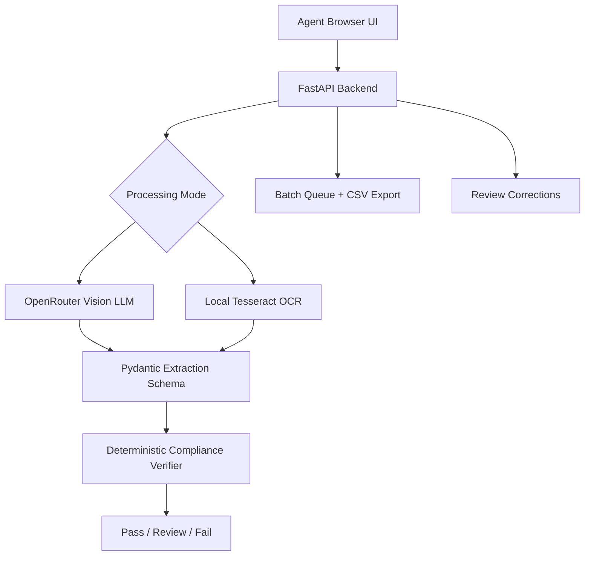

# Treasury Take Home V3

Python LLM-first TTB label verifier for matching alcohol label images against
application data.

V3 changes the architecture from offline-first OCR to **LLM-first image
understanding**. It uses OpenRouter vision-capable models by default and keeps
local Tesseract OCR as an explicit offline testing mode.

## What It Does

- Verifies single products with 1-4 front/back/side label images.
- Supports batch uploads with JSON or CSV manifests.
- Sends images to OpenRouter in LLM mode and asks for structured JSON extraction.
- Applies deterministic Python compliance checks after extraction.
- Preserves Review/Fail workflow for agents.
- Keeps local OCR available through a separate button for offline testing.
- Keeps raw model/OCR extraction hidden unless server-side debug is enabled.

## Key Policy Rules

- Missing or non-all-caps `GOVERNMENT WARNING` is always Fail.
- Exactly one missing observed field, excluding government warning, is Review.
- Two or more missing observed fields are Fail.
- Hard conflicts such as wrong ABV, wrong net contents, or conflicting country are Fail.
- The LLM extracts evidence; Python code decides the final verdict.

## Architecture



## Runtime Configuration

```text
OPENROUTER_API_KEY=...
OPENROUTER_MODEL=nex-agi/nex-n2-pro
OPENROUTER_BASE_URL=https://openrouter.ai/api/v1
PROCESSING_MODE=llm
ALLOW_LOCAL_OCR=true
SHOW_RAW_EXTRACTION=false
BATCH_PARALLELISM=2
LLM_REQUEST_TIMEOUT_SECONDS=30
```

## Run Locally

```powershell
python -m venv .venv
.\.venv\Scripts\Activate.ps1
pip install -r requirements-dev.txt
$env:OPENROUTER_API_KEY="your-key"
uvicorn app.main:app --reload --port 8000
```

Open:

```text
http://localhost:8000
```

## Docker

```powershell
docker build -t treasury-take-home-v3 .
docker run --rm -p 8000:8000 `
  -e OPENROUTER_API_KEY="your-key" `
  -e OPENROUTER_MODEL="nex-agi/nex-n2-pro" `
  treasury-take-home-v3
```

## Tests

```powershell
pytest
ruff check
```

## Deployment Notes

The included GitHub Actions workflow builds a Docker image and updates Azure
Container Apps on pushes to `main`. Configure these secrets before enabling the
workflow:

- `AZURE_CREDENTIALS`
- `ACR_NAME`
- `ACR_LOGIN_SERVER`
- `AZURE_CONTAINER_APP_NAME`
- `AZURE_RESOURCE_GROUP`
- Container App secret: `openrouter-api-key`

Azure hosts the container. OpenRouter performs the LLM image extraction in default
mode, so V3 is not offline-first by default. Use Local OCR Test mode when the
firewall/no-outbound scenario needs to be demonstrated.

