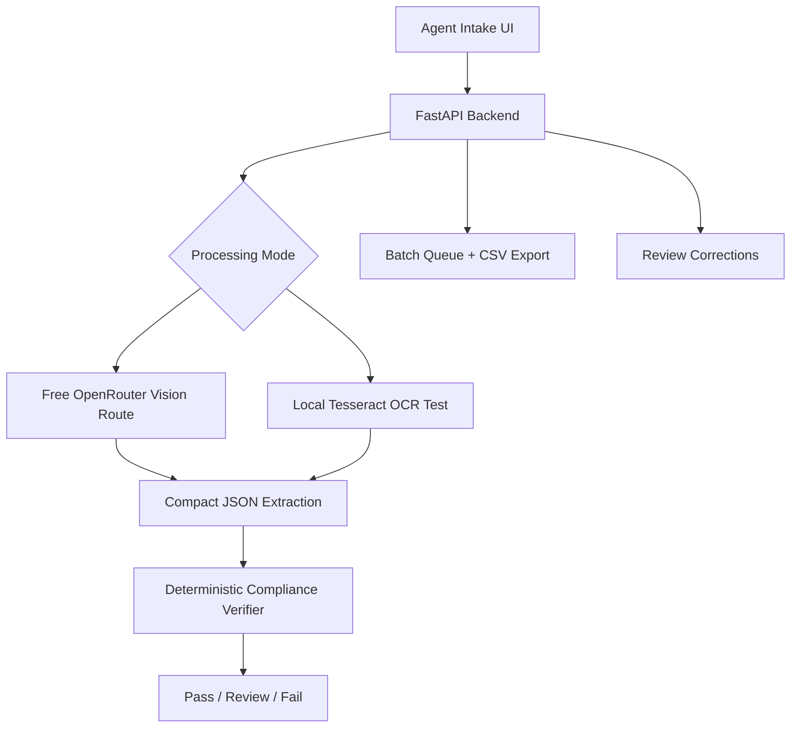

# Treasury Take Home V3

AI-assisted TTB label verifier for agents who need one place to upload label images, compare them against application data when available, and resolve review/fail cases.

V3 is **LLM-first** by default, using OpenRouter vision models for structured label extraction. The final compliance decision is still deterministic Python logic. Local Tesseract OCR remains available through an explicit **Local OCR Test** mode for offline/firewall demonstrations.

## Impact Summary

- Two-tab workflow: **Intake** for uploads and **Review** for agent resolution.
- Supports single images, multi-image labels, folder uploads, and manifest-based batches.
- Uses strict free-only OpenRouter routing by default; no paid model fallback.
- Compresses label images into lightweight contact sheets to reduce latency and token cost.
- Keeps raw extraction hidden unless server-side debug configuration allows it.
- Applies deterministic TTB checks after extraction, including hard government-warning failures.

## Key Policy Rules

- Missing or non-all-caps `GOVERNMENT WARNING` is always Fail.
- If application fields are omitted, they are marked `not_checked`, not failed.
- If application fields are supplied, hard conflicts such as wrong ABV, wrong net contents, brand conflict, or country conflict can Fail.
- Exactly one missing observed application field is Review; two or more missing observed fields are Fail.
- The LLM extracts structured evidence; Python code decides Pass, Review, or Fail.

## Architecture



## Free OpenRouter Configuration

Default settings are intentionally free-only:

```text
OPENROUTER_REQUIRE_FREE=true
OPENROUTER_MODEL=google/gemma-4-26b-a4b-it:free
OPENROUTER_FALLBACK_MODELS=openrouter/free
OPENROUTER_ALLOW_PAID_FALLBACK=false
LLM_REQUEST_TIMEOUT_SECONDS=5
OPENROUTER_BASE_URL=https://openrouter.ai/api/v1
PROCESSING_MODE=llm
ALLOW_LOCAL_OCR=true
SHOW_RAW_EXTRACTION=false
BATCH_PARALLELISM=2
```

The app rejects non-free model IDs when free mode is required. Accepted defaults are model IDs ending in `:free` or the `openrouter/free` router. If every free route times out, rate-limits, or fails, the app returns a Review result instead of silently using a paid model.

Free OpenRouter routes are zero-cost routes, not unlimited production capacity. They may have lower rate limits, variable availability, or slower peak-time latency. The model stays configurable so the default can be changed if another free multimodal route benchmarks better.

## LLM Efficiency Approach

- Multi-image products are sent as one compressed contact sheet.
- Images are resized to about a 1000px long edge and encoded as JPEG around quality 65.
- The prompt requests compact structured JSON only, not full raw transcription.
- `max_tokens` is capped around 700.
- OpenRouter HTTP client reuse avoids repeated connection setup.
- Batch parallelism is bounded to avoid rate-limit amplification.

## Run Locally

```powershell
cd C:\Users\NashS\OneDrive\Documents\Treasury-Take-Home
python -m venv .venv
.\.venv\Scripts\Activate.ps1
pip install -r requirements-dev.txt
$env:OPENROUTER_API_KEY="your-key"
uvicorn app.main:app --reload --port 8000
```

Open:

```text
http://localhost:8000
```

To run without OpenRouter, use the UI's **Run Local OCR Test** button and make sure Tesseract is installed locally.

## Docker

```powershell
docker build -t treasury-take-home-v3 .
docker run --rm -p 8000:8000 `
  -e OPENROUTER_API_KEY="your-key" `
  treasury-take-home-v3
```

## Tests

```powershell
pytest
ruff check
```

## Build a COLA Test Dataset

For local testing, the repository includes a public COLA registry scraper that writes a batch-compatible manifest plus downloaded label images. This is not used by the production app; it is only for creating repeatable test data.

```powershell
python scripts/scrape_cola_dataset.py --count 25 --out-dir data/cola_testing
```

If Windows certificate validation fails in your local Python environment, use:

```powershell
python scripts/scrape_cola_dataset.py --count 25 --out-dir data/cola_testing --insecure-tls
```

Outputs:

- `data/cola_testing/application_data.csv`
- `data/cola_testing/manifest.json`
- `data/cola_testing/label_images/`

The `data/` directory is git-ignored so scraped public registry data is not committed by accident.

## Deployment Notes

The included GitHub Actions workflow builds a Docker image and updates Azure Container Apps on pushes to `main`. Configure these secrets before enabling the workflow:

- `AZURE_CREDENTIALS`
- `ACR_NAME`
- `ACR_LOGIN_SERVER`
- `AZURE_CONTAINER_APP_NAME`
- `AZURE_RESOURCE_GROUP`
- Container App secret: `openrouter-api-key`

Azure hosts the container. OpenRouter performs the default LLM image extraction, so V3 is not offline-first by default. Use Local OCR Test mode when the firewall/no-outbound scenario needs to be demonstrated.
